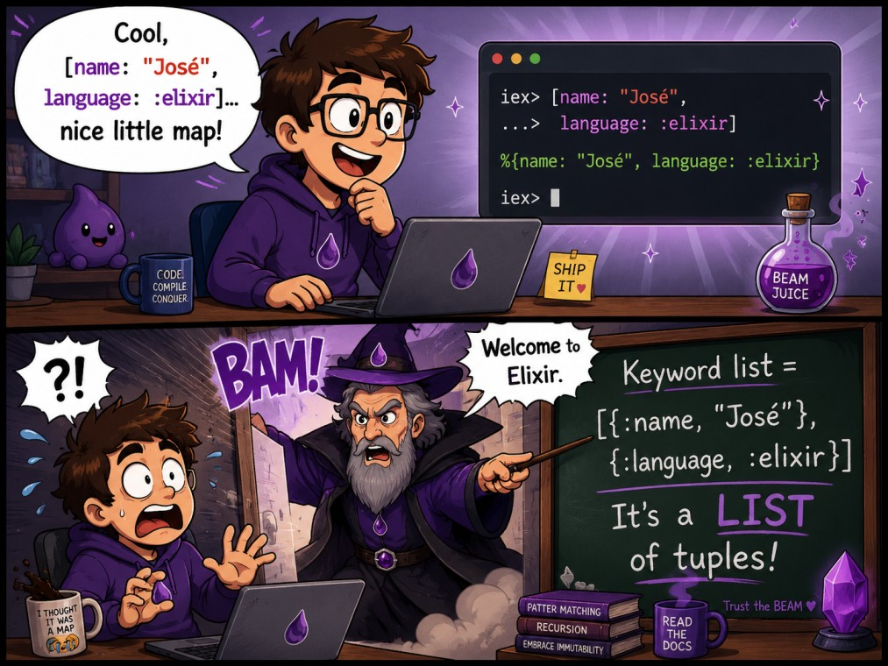

## Keyword list-երը

Նախորդ հոդվածներում ծանոթացել ենք [list-երին](./lists.md), [tuple-ներին](./tuples.md) և [map-երին](./maps.md)։ Այժմ դիտարկենք նոր հավաքածու, որը կազմված է մեզ արդեն ծանոթ list-ից և tuple-ներից։ Այն կոչվում է `keyword list`։

Keyword list-երը հիմնականում կիրառվում են ֆունկցիաներին ընտրանքներ (options) փոխանցելու համար և բերեք սկզբում դիտարկենք, թե ինչ խնդիր են դրանք լուծում։

### Ֆունկցիայի ընտրանքները (options)

`String.split/2` ֆունկցիան string-ը բաժանում է մասերի։ Առաջին արգումենտը բաժանվող string-ն է, երկրորդը՝ բաժանիչը։

```elixir
iex> String.split("red green blue yellow", " ")
["red", "green", "blue", "yellow"]
```

Երբ անհրաժեշտ է սահմանափակել արդյունքի մասերի քանակը, կարելի է փոխանցել `parts` ընտրանքը։

```elixir
iex> String.split("red green blue yellow", " ", [parts: 3])
["red", "green", "blue yellow"]
```

Այս կանչում արդյունքը բաղկացած է առավելագույնը երեք մասից։ Վերջին տարրը պարունակում է string-ի չբաժանված մնացորդը։

`String.split/3`-ն ընդունում է նաև `trim` ընտրանքը։ Այն հեռացնում է դատարկ տարրերը։

```elixir
iex> String.split("red  green  blue", " ", [trim: true])
["red", "green", "blue"]
```

`[parts: 3]`-ը և `[trim: true]`-ն keyword list-երի օրինակներ են։ Յուրաքանչյուր ընտրանք ունի անուն և արժեք։ Այդ պատճառով ֆունկցիայի կանչից անմիջապես հասկանալի է, թե ինչ է նշանակում փոխանցված արժեքը։

Եթե ընտրանքները փոխանցվեին սովորական դիրքային արգումենտներով, օրինակ՝ `String.split(text, separator, true, 3)`, `true`-ի և `3`-ի նշանակությունը կանչից պարզ չէր լինի։ Keyword list-ը յուրաքանչյուր արժեք կապում է բանալու հետ։

### Քառակուսի փակագծերը կարելի է բաց թողնել

Երբ keyword list-ը ֆունկցիայի վերջին արգումենտն է, քառակուսի փակագծերը կարելի է չգրել։ Հետևյալ երկու կանչերը համարժեք են։

```elixir
iex> String.split("red green blue yellow", " ", [parts: 3])
["red", "green", "blue yellow"]

iex> String.split("red green blue yellow", " ", parts: 3)
["red", "green", "blue yellow"]
```

Մի քանի ընտրանքի դեպքում դրանք բաժանվում են ստորակետերով։

```elixir
iex> String.split("red  green  blue yellow", " ", parts: 3, trim: true)
["red", "green", " blue yellow"]
```

Այս համառոտ գրելաձևը գործում է միայն այն դեպքում, երբ keyword list-ը վերջին արգումենտն է։ Մյուս դիրքերում քառակուսի փակագծերը պարտադիր են։

### Ի՞նչ է keyword list-ը

Keyword list-ը սովորական list է, որի յուրաքանչյուր տարրն իր հերթին երկու տարրից կազմված tuple է։ Tuple-ի առաջին տարրը բանալին է և պարտադիր atom է։ Երկրորդ տարրը արժեքն է և կարող է ունենալ ցանկացած տիպ։

```elixir
iex> options = [channel: :sms, urgent: true]
[channel: :sms, urgent: true]

iex> options == [{:channel, :sms}, {:urgent, true}]
true
```

Այս երկու գրելաձևերը ներկայացնում են նույն արժեքը։ `[channel: :sms]` ձևը պարզապես ավելի կարճ է, քան `[{:channel, :sms}]` ձևը։

`Keyword.keyword?/1` ֆունկցիայով կարելի է ստուգել, թե արժեքը keyword list է, թե ոչ։

```elixir
iex> Keyword.keyword?([channel: :sms, urgent: true])
true

iex> Keyword.keyword?([{"channel", :sms}])
false
```

Երկրորդ արժեքը նույնպես list է և պարունակում է երկու տարրից կազմված tuple։ Սակայն դրա բանալին string է, ոչ թե atom։ Այդ պատճառով այն keyword list չէ։

### Իրական կիրառություն՝ ֆունկցիայի ոչ պարտադիր ընտրանքներ

Դիտարկենք ծանուցման համար տվյալներ պատրաստող պարզ module։ Հաղորդագրությունը պարտադիր է, իսկ առաքման ալիքն ու առաջնահերթությունը՝ ոչ։

```elixir
defmodule Notification do
  def prepare(message, options \\ []) do
    channel = Keyword.get(options, :channel, :email)
    urgent = Keyword.get(options, :urgent, false)

    {channel, urgent, message}
  end
end
```

`options` արգումենտի նախնական արժեքը դատարկ list է։ Երբ ընտրանք չի փոխանցվում, `Keyword.get/3`-ը վերադարձնում է երրորդ արգումենտով տրված նախնական արժեքը։

```elixir
iex> Notification.prepare("Weekly report")
{:email, false, "Weekly report"}

iex> Notification.prepare("Payment failed", channel: :sms, urgent: true)
{:sms, true, "Payment failed"}
```

Այս մոտեցման դեպքում պարտադիր տվյալը մնում է սովորական արգումենտ։ Ոչ պարտադիր կարգավորումները հավաքվում են մեկ keyword list-ում։ Հետագայում կարելի է ավելացնել նոր ընտրանք՝ առանց արդեն գոյություն ունեցող կանչերի ձևը փոխելու։

Keyword list-երն այս պատճառով հաճախ են հանդիպում գրադարանների կամ սեփական module-ների ֆունկցիաների կանչերում։ Դրանք հարմար են կարճ կարգավորումների համար, որոնց մեծ մասը ոչ պարտադիր է։

### Keyword list-ի երեք հատկությունները

Keyword list-ն ունի երեք կարևոր հատկություն։

1. Բանալիները պարտադիր atom են։
2. Քանի որ այն list է, տարրերի ընթացիկ հերթականությունը պահպանվում է։
3. Նույն բանալին կարող է հանդիպել մեկից ավելի անգամ։

Կրկնվող բանալիները հնարավոր չեն map-ում, բայց թույլատրված են keyword list-ում։

```elixir
iex> filters = [tag: "elixir", tag: "beam", status: :published]
[tag: "elixir", tag: "beam", status: :published]
```

Քառակուսի փակագծերով կարդալիս կամ `Keyword.get/3` կիրառելիս վերադարձվում է առաջին համընկնող բանալու արժեքը։

```elixir
iex> filters[:tag]
"elixir"

iex> Keyword.get(filters, :tag)
"elixir"
```

Կրկնվող բանալու բոլոր արժեքները ստանալու համար կա `Keyword.get_values/2` ֆունկցիան։

```elixir
iex> Keyword.get_values(filters, :tag)
["elixir", "beam"]
```

Կրկնվող բանալին պետք է կիրառել միայն այն դեպքում, երբ տվյալ ֆունկցիան կամ գրադարանը այդպիսի կառուցվածք է ակնկալում։ Սովորական ընտրանքների դեպքում յուրաքանչյուր բանալի սովորաբար հանդիպում է մեկ անգամ։

Չնայած list-ը պահպանում է տարրերի հերթականությունը, `Keyword` module-ի ֆունկցիաները չեն խոստանում, որ ավելացված կամ թարմացված զույգը կմնա կոնկրետ դիրքում։ Ծրագրի տրամաբանությունը չպետք է կախված լինի keyword list-ի բանալիների դիրքից։

### Արժեքների ընթերցումը

Keyword list-ի արժեքը կարելի է կարդալ քառակուսի փակագծերով։ Չեղած բանալու դեպքում ստացվում է `nil`։

```elixir
iex> options = [format: :csv, headers: true]
[format: :csv, headers: true]

iex> options[:format]
:csv

iex> options[:delimiter]
nil
```

`Keyword.get/3`-ը թույլ է տալիս նշել նախնական արժեք։

```elixir
iex> Keyword.get(options, :delimiter, ",")
","
```

Այս ձևը հատկապես հարմար է ֆունկցիայի ընտրանքների համար։ Բանալին չլինելու դեպքում ֆունկցիան շարունակում է աշխատել նախապես ընտրված կարգավորմամբ։

### Ավելացումը, թարմացումը և հեռացումը

Քանի որ keyword list-ը list֊ի առանձնահատուկ տեսակ է, դրա հետ աշխատում են նաև list-երի գործողությունները։ Օրինակ՝ `++` օպերատորով կարելի է միացնել երկու keyword list։

```elixir
iex> options = [format: :csv, headers: true]
[format: :csv, headers: true]

iex> options ++ [delimiter: ","]
[format: :csv, headers: true, delimiter: ","]
```

Սակայն `++`-ը գոյություն ունեցող բանալին չի փոխարինում։ Այն պարզապես ավելացնում է ևս մեկ tuple։

```elixir
iex> options ++ [format: :json]
[format: :csv, headers: true, format: :json]
```

Այս արդյունքն ունի երկու `format` բանալի։ `Keyword.get/3`-ը կվերադարձնի առաջինը՝ `:csv`։ Երբ անհրաժեշտ է փոխարինել արժեքը, պետք է կիրառել `Keyword.put/3`։

```elixir
iex> Keyword.put([format: :csv], :format, :json)
[format: :json]
```

Բանալին հեռացնելու համար կիրառվում է `Keyword.delete/2`։

```elixir
iex> Keyword.delete([format: :csv, headers: true], :headers)
[format: :csv]
```

Բնականաբար այս ֆունկցիաները չեն փոփոխում սկզբնական list-ը։ Դրանք վերադարձնում են նոր keyword list, քանի որ Elixir-ում տվյալներն անփոփոխ են։

### Pattern matching-ի սահմանափակումը

Keyword list-ի հետ pattern matching-ը տեխնիկապես հնարավոր է։ Սակայն list-ի կաղապարը պահանջում է, որ տարրերի քանակն ու հերթականությունը ճշգրտորեն համընկնեն։

```elixir
iex> [format: format] = [format: :csv]
[format: :csv]

iex> format
:csv
```

Նույն կաղապարը չի համընկնի, երբ list-ում ուրիշ ընտրանքներ էլ կան։

```elixir
iex> [format: format] = [format: :csv, headers: true]
** (MatchError) no match of right hand side value: [format: :csv, headers: true]
```

Բանալիների այլ հերթականությունը նույնպես սխալ է առաջացնում։

```elixir
iex> [headers: headers, format: format] = [format: :csv, headers: true]
** (MatchError) no match of right hand side value: [format: :csv, headers: true]
```

Ֆունկցիայի ընտրանքների դեպքում բանալիների մի մասը կարող է բացակայել, իսկ դրանց հերթականությունը կարող է տարբեր լինել։ Այդ պատճառով keyword list-երի հետ գործնականում pattern matching չի կիրառվում։ Արժեքները պետք է կարդալ `Keyword.get/3`, `Keyword.fetch/2` և `Keyword` module-ի մյուս ֆունկցիաներով։

### Keyword list, թե՞ map

Keyword list-ը և map-ը երկուսն էլ բանալին կապում են արժեքի հետ, բայց նախատեսված են տարբեր խնդիրների համար։ Keyword list-ը ճիշտ ընտրություն է կարճ և հիմնականում ոչ պարտադիր կարգավորումների համար։ Օգտատերեր, ապրանքներ, պատվերներ կամ մեծ քանակով բանալի-արժեք տվյալներ պահելու համար պետք է կիրառել map։

### Չափը և արագությունը

Քանի֊որ Keyword list-ը list֊ի տեսակ է, հետևաբար բանալի գտնելու համար այն հերթականությամբ անցնում է տարրերով։ `Keyword.get/3`-ի և keyword list-ի շատ այլ գործողությունների բարդությունը `O(n)` է։ Որքան երկար է list-ը, այնքան շատ տարր պետք է ստուգվի։

Ֆունկցիայի ընտրանքները սովորաբար քիչ են, ուստի Keyword list֊ի կիրառությունը արդյունավետության խնդիր չի առաջացնում։ Սակայն երբ բանալիների քանակը մեծ է կամ տվյալները հաճախ են որոնվում, map-ն ավելի ճիշտ ընտրություն է։

### `do` բլոկները նույնպես keyword list են

Keyword list-եր արդեն կիրառել ենք՝ առանց դրանց կառուցվածքը մանրամասն իմանալու։ Դիտարկենք `if/2` մակրոն։

```elixir
iex> order_total = 12_000
12000

iex> if order_total >= 10_000 do
...>   :free_delivery
...> else
...>   :paid_delivery
...> end
:free_delivery
```

`do` և `else` բլոկները կազմում են `if/2`-ի երկրորդ արգումենտը։ Այդ արգումենտը keyword list է։ Նույն կանչը կարելի է գրել մեկ տողով։

```elixir
iex> if(order_total >= 10_000, do: :free_delivery, else: :paid_delivery)
:free_delivery
```

Այն համարժեք է քառակուսի փակագծերով տարբերակին։

```elixir
iex> if(order_total >= 10_000, [do: :free_delivery, else: :paid_delivery])
:free_delivery
```

Այսինքն՝ `do`-ն ու `else`-ը հատուկ տեսակի իդենտիֆիկատորներ չեն։ Դրանք `:do` և `:else` atom բանալիների համառոտ գրելաձևերն են։ `do`/`end` բլոկը keyword list փոխանցելու համար նախատեսված ավելի հարմար գրելաձև է, երբ արժեքը մեկ կամ մի քանի արտահայտությունից կազմված կոդ է։

Նախկին հոդվածներում հանդիպել ենք ֆունկցիայի համառոտ սահմանմանը։

```elixir
def double(number), do: number * 2
```

Այստեղ `do: number * 2`-ը `def/2` մակրոյին փոխանցվող keyword list-ի մասն է։ 

### Փորձեք ինքներդ

Բացեք iex-ը և ստեղծեք `[format: :csv, headers: true, delimiter: ","]` keyword list-ը։ Կարդացեք գոյություն ունեցող և չեղած բանալիների արժեքները `[]`-ով։ Այնուհետև կիրառեք `Keyword.get/3`՝ չեղած բանալու համար նախնական արժեք սահմանելով։ Փոխեք `format`-ը `Keyword.put/3`-ով և հեռացրեք `headers`-ը `Keyword.delete/2`-ով։ Ստուգեք, որ սկզբնական list-ը մնացել է անփոփոխ։

Այնուհետև ստեղծեք `Report.prepare/2` ֆունկցիան։ Առաջին արգումենտով այն պետք է ստանա հաշվետվության անունը, իսկ երկրորդով՝ keyword list։ `format` ընտրանքի լռելյայն արժեքը թող լինի `:pdf`, իսկ `include_summary` ընտրանքինը՝ `true`։ Ֆունկցիան թող վերադարձնի `{name, format, include_summary}` tuple։ Կանչեք այն առանց ընտրանքների, մեկ ընտրանքով և երկու ընտրանքով։

Վերջում վերցրեք նախկին հոդվածներից որևէ `if` բլոկ և գրեք դրա համարժեք մեկտողանոց տարբերակը՝ `do:` և `else:` բանալիներով։

### Աղբյուրներ

- [Elixir — պաշտոնական կայք](https://elixir-lang.org)
